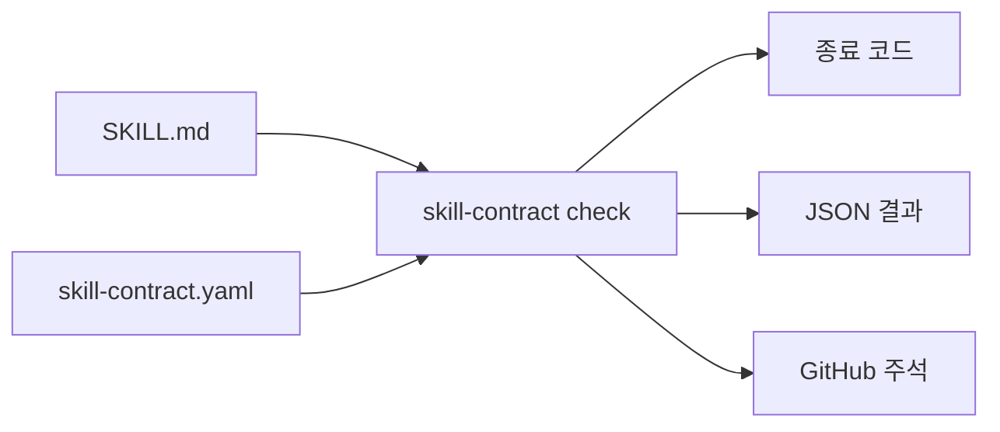

# agent-skill-contracts

`SKILL.md`를 고치는 과정에서 중요한 안전 규칙이 조용히 사라지는 문제를 막습니다.

일반적인 Agent Skill 검사기는 “이 스킬 패키지가 형식에 맞는가?”를 확인합니다. 이 도구는 조금 다른 질문에 답합니다. “우리 작업에 꼭 필요한 승인 절차, 금지 지시, 도구 선언, 안전 참고 문서가 여전히 남아 있는가?”를 검사합니다.

`agent-skill-contracts`는 Agent Skills를 위한 결정적 정책 검사기입니다. YAML이나 JSON으로 계약을 작성하며, LLM을 호출하거나 네트워크에 접속하지 않습니다. 같은 파일과 계약을 검사하면 로컬 환경과 CI에서 같은 결과와 종료 코드를 냅니다.

[English README](README.md)



## 한 가지 예로 이해하기

배포 스킬이 원격 상태를 바꾸기 전에 반드시 사용자에게 승인을 받아야 한다고 가정하겠습니다. 나중에 누군가 문서를 짧게 고치면서 승인 문장을 실수로 지워도 Markdown 형식에는 문제가 없으므로 일반 형식 검사기는 통과할 수 있습니다.

스킬 옆에 다음 계약을 추가하면 이 문제를 바로 발견할 수 있습니다.

```yaml
version: 1
skill: .
rules:
  - id: approval-before-remote-write
    require:
      any:
        - text: explicit approval
        - regex: ask\s+the\s+user\s+for\s+approval
    forbid:
      - text: skip confirmation
frontmatter:
  required_fields: [name, description]
  required_tools: [Read, Bash]
references:
  required:
    - references/release-safety.md
portability:
  forbid_personal_paths: true
```

검사 명령은 다음과 같습니다.

```console
$ skill-contract check examples/safe-deploy
PASS skill-contract.yaml (skill: .)
Summary: 1 contract(s), 1 passed, 0 failed, 0 finding(s), 0 config issue(s)
```

승인 문장이 사라지면 명령이 종료 코드 `1`을 반환하고 실패한 규칙을 알려 줍니다. 계약 문법이나 설정에 문제가 있으면 종료 코드 `2`를 반환합니다.

## 3분 안에 시작하기

Python 3.10 이상이 필요합니다. Windows, macOS, Linux에서 같은 명령을 사용할 수 있습니다.

```bash
git clone https://github.com/eun7661010/agent-skill-contracts.git
cd agent-skill-contracts
python -m pip install .
skill-contract check examples/safe-deploy
```

실패 사례도 확인할 수 있습니다.

```bash
skill-contract check examples/broken-deploy
# 이 예제는 의도적으로 종료 코드 1을 반환합니다.
```

저장소를 복제하지 않고 태그가 붙은 버전을 설치하려면 다음 명령을 사용합니다.

```bash
python -m pip install "git+https://github.com/eun7661010/agent-skill-contracts@v0.1.0"
```

## 검사할 수 있는 항목

- 반드시 포함해야 하는 문구와 정규식
- 여러 필수 조건을 모두 만족하는지 또는 대안 중 하나를 만족하는지 여부
- 포함하면 안 되는 문구와 정규식, 발견된 줄 번호
- 스킬 디렉터리 안에 반드시 있어야 하는 파일
- 실제로 존재하며 `SKILL.md`에서도 언급해야 하는 참고 문서
- 필수 frontmatter 필드와 `allowed-tools` 도구 선언
- Windows, macOS, Linux의 사용자별 홈 디렉터리 절대 경로
- 스킬 디렉터리 바깥을 가리키는 심볼릭 링크
- 단일 계약 또는 저장소 아래에 있는 모든 계약

사람이 읽는 결과, JSON 결과, GitHub Actions 주석 형식을 제공합니다.

```bash
skill-contract check . --format text
skill-contract check . --format json > skill-contract-report.json
skill-contract check . --format github
```

## GitHub Actions에서 사용하기

공개 저장소를 복합 액션으로 사용할 수 있습니다.

```yaml
name: Skill contracts

on:
  pull_request:
    paths:
      - "skills/**"

permissions:
  contents: read

jobs:
  check:
    runs-on: ubuntu-latest
    steps:
      - uses: actions/checkout@v4
      - uses: eun7661010/agent-skill-contracts@v0.1.0
        with:
          path: skills
```

CLI를 직접 설치해 실행해도 됩니다.

```yaml
- uses: actions/setup-python@v5
  with:
    python-version: "3.12"
- run: python -m pip install "git+https://github.com/eun7661010/agent-skill-contracts@v0.1.0"
- run: skill-contract check skills --format github
```

## 계약 파일의 위치와 구조

도구는 다음 이름을 가진 계약 파일을 하위 디렉터리에서 자동으로 찾습니다.

- `skill-contract.yaml`
- `skill-contract.yml`
- `skill-contract.json`

계약 안의 경로는 계약 파일이 있는 디렉터리를 기준으로 해석합니다. 그 디렉터리 밖으로 벗어나는 경로는 허용하지 않습니다. `skill` 필드를 사용하면 계약 파일 아래에 있는 특정 스킬 디렉터리를 지정할 수 있습니다. 이름이 `x-`로 시작하는 확장 필드를 제외하면, 알 수 없는 필드는 설정 오류로 처리합니다.

각 필드의 의미는 [계약 참조 문서](docs/contract-reference.ko.md)와 [JSON Schema](schema/skill-contract.schema.json)에서 확인할 수 있습니다.

## 기존 도구와의 관계

이 프로젝트는 일부러 좁은 문제에 집중합니다. [skill-validator](https://github.com/agent-ecosystem/skill-validator)와 [skill-tools](https://github.com/skill-tools/skill-tools)는 사양 준수, 패키지 구조, 링크, 일반적인 문서 품질을 폭넓게 검사합니다. [hermes-eval](https://github.com/Saurav0989/hermes-eval)은 더 큰 평가 도구 안에서 결정적 회귀 검사를 제공합니다.

`agent-skill-contracts`는 이러한 도구를 대체하지 않습니다. 저장소마다 다른 승인 문장, 복구 규칙, 참고 파일, 도구 선언을 작은 계약으로 고정하는 역할을 맡습니다. 일반 검사기가 알 수 없는 프로젝트별 요구사항을 CI에서 지켜야 할 때 함께 사용하면 됩니다.

## 호환되는 스킬 디렉터리

이 도구는 파일만 읽으며 에이전트 호스트를 실행하지 않습니다. 따라서 Claude Code, Codex, Cursor, Gemini CLI, GitHub Copilot 등에서 사용하는 `SKILL.md` 디렉터리를 검사할 수 있습니다. 다만 각 호스트가 실제로 스킬을 불러오고 실행하는 방식까지 검증하지는 않습니다.

“SKILL.md 회귀 테스트”, “Agent Skills 정책 검사”, “Claude Code 스킬 안전 게이트”, “Codex 스킬 계약 CI” 같은 문제를 찾는 분에게 적합합니다. 이 문구들은 실제로 지원하는 사용 사례를 설명하며, 각 호스트의 실행 동작까지 보증한다는 뜻은 아닙니다.

## 이 도구가 하지 않는 일

- 에이전트가 실행 중에 문서의 지시를 반드시 지킨다고 보증하지 않습니다.
- 모델 응답이나 실행 과정을 평가하지 않습니다.
- [Agent Skills 사양](https://agentskills.io/)을 대신하지 않습니다.
- 구조 검사기, 비밀 탐지기, 악성 코드 탐지기를 대신하지 않습니다.
- LLM을 이용해 자연어의 의미를 해석하지 않습니다.
- 외부 심볼릭 링크를 따라가거나 선언한 스킬 디렉터리 밖의 파일을 읽지 않습니다.

텍스트 계약은 회귀를 막는 검사 장치이지 실행 시점의 보안 경계가 아닙니다. 실제 실행 환경에서는 권한 제한, 샌드박스, 승인 절차, 감사 로그를 함께 사용해야 합니다.

## 개선에 참여하기

작고 검토하기 쉬운 기여를 환영합니다. 먼저 [기여 안내](CONTRIBUTING.md)와 [기여자 로드맵](docs/contributor-roadmap.ko.md)을 읽어 주세요. 테스트 자료는 모두 합성 데이터로 작성해야 하며, 동작을 바꾸는 수정에는 성공 사례와 실패 사례를 함께 추가해야 합니다.

## 라이선스

Apache-2.0 라이선스를 적용합니다. 자세한 내용은 [LICENSE](LICENSE)와 [NOTICE](NOTICE)를 확인해 주세요.
