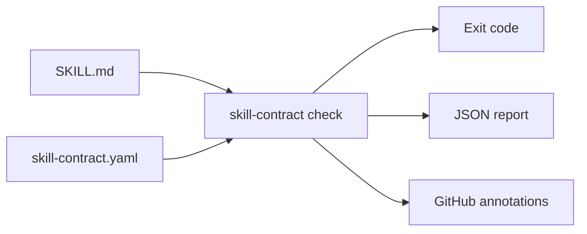

# agent-skill-contracts

[](https://github.com/eun7661010/agent-skill-contracts/actions/workflows/ci.yml)
[](LICENSE)
[](pyproject.toml)

Keep safety rules from quietly disappearing when `SKILL.md` changes.

General Agent Skill validators answer, “Is this a valid skill package?” This tool answers a different question: “Does this skill still contain the approval boundary, prohibited instruction, declared tool, and referenced safety file that our workflow depends on?”

`agent-skill-contracts` is a deterministic, offline policy-as-code checker for Agent Skills. It uses an explicit YAML or JSON contract, makes no LLM calls, and returns stable exit codes for local development, pre-commit hooks, and GitHub Actions.

[한국어 문서](README.ko.md)



## The problem in one example

Suppose a deployment skill must ask before changing remote state. A later edit shortens the instructions and accidentally removes that sentence. The Markdown still looks valid, so a format linter passes it.

Add a small contract next to the skill:

```yaml
version: 1
skill: .
rules:
  - id: approval-before-remote-write
    require:
      any:
        - text: explicit approval
        - regex: ask\s+the\s+user\s+for\s+approval
    forbid:
      - text: skip confirmation
frontmatter:
  required_fields: [name, description]
  required_tools: [Read, Bash]
references:
  required:
    - references/release-safety.md
portability:
  forbid_personal_paths: true
```

Run the check:

```console
$ skill-contract check examples/safe-deploy
PASS skill-contract.yaml (skill: .)
Summary: 1 contract(s), 1 passed, 0 failed, 0 finding(s), 0 config issue(s)
```

If the approval clause disappears, the command exits with code `1` and identifies the failed rule. Invalid contract syntax exits with code `2`.

## Three-minute quick start

Requirements: Python 3.10 or newer. The checker works on Windows, macOS, and Linux.

```bash
git clone https://github.com/eun7661010/agent-skill-contracts.git
cd agent-skill-contracts
python -m pip install .
skill-contract check examples/safe-deploy
```

To try the expected failure path:

```bash
skill-contract check examples/broken-deploy
# exits 1 by design
```

To use the tagged release without cloning:

```bash
python -m pip install "git+https://github.com/eun7661010/agent-skill-contracts@v0.1.0"
```

## What it checks

- Required text or regular expressions, with `all` and `any` semantics
- Forbidden text or regular expressions, including the matching line number
- Files that must exist inside the skill directory
- References that must both exist and be mentioned by `SKILL.md`
- Required frontmatter fields and `allowed-tools` declarations
- Duplicate YAML or JSON mapping keys that could hide an earlier rule or setting
- User-specific Windows, macOS, and Linux home paths
- Symlinks that leave the skill directory
- One contract or every contract below a repository path

The CLI supports text, JSON, and GitHub Actions annotation output:

```bash
skill-contract check . --format text
skill-contract check . --format json > skill-contract-report.json
skill-contract check . --format github
```

## GitHub Actions

Use the repository as a composite action:

```yaml
name: Skill contracts

on:
  pull_request:
    paths:
      - "skills/**"

permissions:
  contents: read

jobs:
  check:
    runs-on: ubuntu-latest
    steps:
      - uses: actions/checkout@v7
      - uses: eun7661010/agent-skill-contracts@v0.1.0
        with:
          path: skills
```

Or install the CLI explicitly:

```yaml
- uses: actions/setup-python@v7
  with:
    python-version: "3.12"
- run: python -m pip install "git+https://github.com/eun7661010/agent-skill-contracts@v0.1.0"
- run: skill-contract check skills --format github
```

## Contract layout

The checker discovers these filenames recursively:

- `skill-contract.yaml`
- `skill-contract.yml`
- `skill-contract.json`

Paths inside a contract are relative to the contract directory and may not escape it, including glob patterns under `portability.scan`. Duplicate YAML or JSON keys are rejected instead of silently keeping one value. The optional `skill` field points to a skill directory below that location. Unknown fields fail closed unless their names start with `x-`.

See the [contract reference](docs/contract-reference.md) and the machine-readable [JSON Schema](schema/skill-contract.schema.json) for every field.

## Where this fits

This project is deliberately narrow. Tools such as [skill-validator](https://github.com/agent-ecosystem/skill-validator) and [skill-tools](https://github.com/skill-tools/skill-tools) cover specification compliance, package structure, links, and general content quality. [hermes-eval](https://github.com/Saurav0989/hermes-eval) includes deterministic regression checks within a broader evaluation tool.

`agent-skill-contracts` complements those tools with a small, repository-owned behavioral contract. It is useful when a generic linter cannot know which approval clause, recovery rule, reference file, or tool declaration is mandatory for your workflow.

## Compatible skill directories

The checker reads files; it does not run an agent host. It can therefore check `SKILL.md` packages stored for Claude Code, Codex, Cursor, Gemini CLI, GitHub Copilot, or another host that follows the Agent Skills layout. Host-specific behavior is outside the checker’s scope.

Typical searches that lead to this tool include “SKILL.md regression testing,” “Agent Skills policy as code,” “Claude Code skill safety gate,” and “Codex skill contract CI.” These phrases describe the supported use cases rather than separate compatibility promises.

## Non-goals

- Proving that an agent will obey the instructions at runtime
- Evaluating model responses or trajectories
- Replacing the [Agent Skills specification](https://agentskills.io/)
- Replacing structural validators, secret scanners, or malware scanners
- Interpreting natural-language meaning with an LLM
- Following external symlinks or reading files outside the declared skill directory

Text contracts are regression gates, not runtime security boundaries. Use host permissions, sandboxing, approval controls, and audit logs for runtime enforcement.

## Contributing

Small, reviewable contributions are welcome. Start with [CONTRIBUTING.md](CONTRIBUTING.md) and the [contributor roadmap](docs/contributor-roadmap.md). Every fixture must be synthetic, and every behavior change needs a positive test and a negative control.

The [provenance notes](docs/provenance.md) record the runtime dependency, clean implementation boundary, and fixture policy.

## License

Apache-2.0. See [LICENSE](LICENSE) and [NOTICE](NOTICE).
